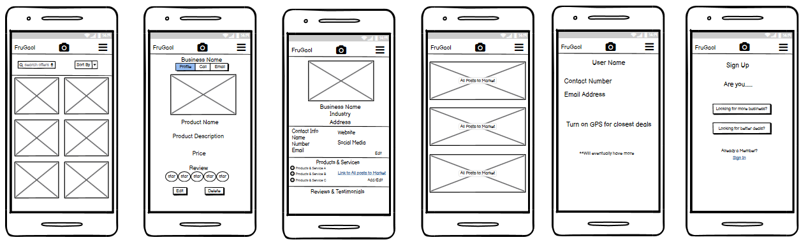
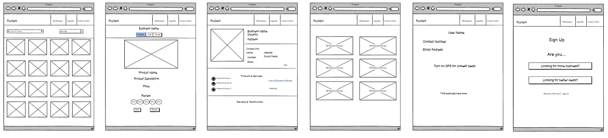
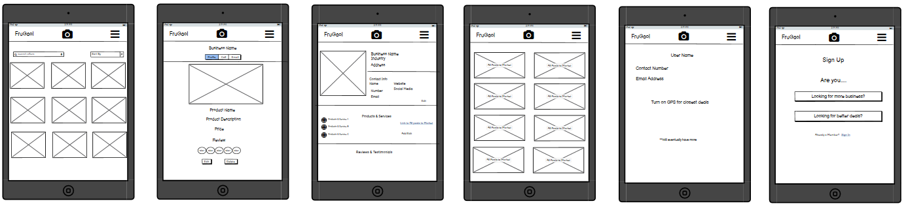

# Project Name - FruGaol

07/08/2021  
The purpose/ambition of Project FruGaol is to create an application that helps promote and encourage local commerce. This app is to connect SME’s to consumers in a more effective and meaningful way. Ultimately I want to cut the fuss out of advertising and give businesses who are on the app a platform to be able to generate more business in the locality and offer real time promos, discounts and services to people/consumers that might be looking for it. 

The idea in my head of level of connection is the likes of petrol stations can advertise their fuel prices and items or hairdressers/cleaners can advertise there availability. In this fast paced world I want this app to demonstrate and portray what business has to user and what user has to user in as real time as possible.

I also want to create an award system so that consumers are rewarded for informing other consumers of special promos/prices and whether they recommend doing business with a business.(maybe not for this assignment) 

I want this to be able to take over as the main SME to customer directory/database. I want to take everything that is good from the GoldenPages, Facebook Marketplace, Yelp, Google My Business, GroupOn, Uber and Amazon to nurture local business and help promote and grow local commerce.

## Table of Contents:

- [UX](#ux)  
- [Features](#features)  
- [Technologies Used](#technologies-used)  
- [Testing](#testing)  
- [Deployment](#deployment)  
- [Credits](#credits)  

## UX

The UX for this project will be investigated through the following 5 planes:

### Strategy Plane:  

Why are we special? – Frugaol is special because it is attempting to help smes in a way that hasn’t been done yet. It is attempting to connect local smes to the consumer in more interactive ways than other directory services of its type. The ambition is to have a platform that takes everything good with the likes of GroupOn, Marketplace, Instagram, GoldenPages, GMB etc and have this utilized into one platform where both the Business and the Consumer will find benefit with. 

Who are competitors? What are they doing?
Main competitors are the following:
- Goldenpages: So far acts as a business directory/phonebook to allow for customers to interact with businesses, however this is outdated. 
- Marketplace: Allows businesses and individuals to sell their products but more orientated towards c2c trading rather than b2c. Also unable to promote services through this. 
- GroupOn: Provides a platform for businesses to display offers/discounts however is not appropriately utilized in Ireland compared to US. Argument that its not properly utilised in US either. I want to take GroupOns idea of displaying deals and discounts and intertwine it with MarketPlace concept to allow businesses to display their own offers. 
- Amazon: Amazon is consumerism gone mad and has crippled local economies. I want to take this Amazon concept in terms of product directory and allow local smes to reap the rewards. Also with services. 
- GMB: Captures business important info and displays this in known and unknown search. 
- Fiver: gives businesses a platform to avail of services that may be more costly to get done elsewhere. 

Tech considerations?  
The purposes of this assignment is to build out an App using Python primarily. However, like all good apps,  this is built with mobile in mind. I will be building this from Mobile view out to desktop. 

Why would a user want this?  
Purpose of this is to help promote local commerce in a way that both local smes and its consumers will find beneficial. I want customers to be adequately informed of deals and offers available to them and businesses be able to communicate their offers, products and services to its potential customers. 

Who is my target audience?  
- My product is for both businesses and consumers alike. 

For Businesses:  
- The aim of Project FruGaol is to help promote and nurture local commerce. The end goal is to have an application that is the go to for any small or medium sized enterprise to generate business. 

For consumers:  
- As a consumer looking to engage more with local smes, a good experience means great customer service, competitive pricing, ability to receive my product/service in as short a timeframe as possible. 
- For the purposes of this app, as a customer I want to come straight through to page with offers & discounts displayed and available. As a business user, I want to be able to display my offers/products/services as quickly and easily as possible. 
- A good user experience would be being able to see from the get go what offers/deals are available to me. From this page I want ability to be able to search for products/services/categories that are near to me. 

What's worth doing?

Opportunity/Problem | Important | Feasability/Viability 
--- | --- | ---
Sign Up and Log in Feature | 5 | 5 |
Business Sign Up and Customer sign up | 5	| 4
Business to be able to create and display offers and discounts on their products and services or whatever they want to advertise.  | 5 | 4
Marketplace when opens shows all offers near to them sorted by closest first. All products and services are mixed.  | 5 | 2
Option to sort by Products go to product page | 3 | 2
Option to sort by Services go to services | 3 |2
Filter option to sort by product/service | 4 |2
Review Area for customers to leave reviews on business product or service.  | 5 | 3
Search functionality to search for industry, products or services | 5 | 3
Reward system for businesses and users that actively engage with app | 1 | 1
In app messenging system | 4 | 1
Tablet/Mobile Camera Post to Marketplace | 4 | 1
Option for consumers to post offers on business behalf | 1	| 1
Users to be able to post their own offers/sell own products | 3	| 1
Notification system to notify/remind users of particular special days | 3 | 1
GPS tracking on app to show closest offers and deals for user | 3 | 1
GPS tracking on app to show closest businesses to user | 1 | 1
		

 

How is our offering, or proposed offering, different from our competitors and substitutes?  

FruGaol differs from the competition as no other platform has attempted to connect local SMEs to its consumers in this way. MarketPlace and Goldenpages are closest to this app but Marketplace is more focused on C2C while GoldenPages acts as a glorified phonebook rather than a platform that is actively attempting to promote local commerce. 

 

### Scope Plane:

 

Whats on the table?
- Sign Up and Login
- Business Sign Up and Customer sign up
- Business to be able to post and display offers and discounts on their products and services or whatever they want to advertise. 
- Marketplace when opens shows all offers near to them sorted by closest first. All products and services are mixed. 
- Option to sort by Products go to product page
- Option to sort by Services go to services
- Review Area for customers to leave reviews on business product or service. 
- Search functionality to search for industry, products or services. 
- Refine search by value amounts
- Business sign up includes:
    - Business name, sign uppers name, contact number, email, facebook/ig/twitter/linkedin, website, service/industry they are in (multiple accepted, address (is it static or mobile?), upload image for logo. 
- Business Profile Page Includes: 
    - Image of logo, business name, industry/service, Address, Email Address, contact number, website link, Products/Services Available (types), Products and services on special offer (posts to MarketPlace page and second profile page?),  links to social media, 
- Customer Sign Up includes:
    - Name, gender, age, email address, contact number (optional), 
- Customer Profile Page: 
    - Edit details, similar to business profile, delete account option. 

User Storys:

Business:
- As a business end user I want to:
    - Be able to connect better with customers, especially close by.
    - Generate more business
    - Show more real time offers and deals to entice new customers ie, petrol station to show current fuel prices.
    - Want to be able to time and display offers seasonally ie, florist to make offers around mothers day, etc
    - Show customers new products/services on offer
    - Better advertise to customers who are actively looking to buy  

Customer:
- As a customer user I want to:
    - Be informed about local offers/deals in my area. 
    - I want to be able to communicate quickly, efficiently and effectively through messenger. 
    - I want to be able to leave reviews on products and services and businesses.
    - I want to share business profiles

 

### The Structure Plane:
Different Pages:
- (1) MarketPlace page,
    - (1.1.1) Options to search solely for services or products
- (2) Business Profile Page 
    - (2.1) One page has all info and 
    - (2.2) other page shows all deals sent from business (similar look to Market place page but one photo rather than 2
- (3) User Profile Page
- (4) Specific Item/Service pages
    - Created by the business owner. Like a sales post. 
    - Has details of product/service. Same page opens through from marketplace and business page. (2 ways to arrive at)
    - Edit/Delete functionality for businesses to delete their offers from MarketPlace. 
- (5) Sign Up/Login page
    - First page shown when new user comes to app. 
        - Are you looking for business? 
            - Brings through to Business Sign Up 
        - Are you looking for deals?
            - Brings through to user/customer sign up
        - Sign In
    - If remembers login, goes straight through to MarketPlace page.
        - Logout page becomes available

### Skeleton Plane:
Mobile Wireframes

Desktop Wireframes

Tablet Wireframes

### The Surface plane:

## Features:

###

## Technologies Used 

 

## Testing

Testing file can be found through the following [link](TESTING.md)

 

## Deployment

 was developed using Gitpod IDE, committed to git and pushed to GitHub using the built in function within gitpod. 

To deploy this page to GitHub pages from its GitHub repository, the following steps were taken:

1. Log into GitHub.
2. From list of repos on screen, select [ShiftyKitty/MS2-Smeach-Cuimhne-Game](https://github.com/ShiftyKitty/MS2-Smeach-Cuimhne-Game)
3. From the menu items near the top of the page, select Settings.
4. Scroll to GitHub Pages section. Alternatively select Pages tab on left hand side of screen in Desktop.
5. Under Source click the drop-down menu labelled None and select Master Branch
6. On selecting Master Branch the page is automatically refreshed. If this does not occur refresh the page. 
7. Go back to GitHub Pages section to retrieve the link to the deployed website.

At the moment of submitting this Milestone project, the Development Branch and Master Branch are identical. 

### How to run this project locally
To clone this project from Github:

1. Follow this link to [ShiftyKitty/MS2-Smeach-Cuimhne-Game](https://github.com/ShiftyKitty/MS2-Smeach-Cuimhne-Game)
2. Above the list of files, click Code.
3. In the Clone with HTTPs section, copy the clone URL for the repository. 
4. In your local IDE open Git Bash.
5. Change the current working directory to the location where you want the cloned directory to be made. 
6. Type git clone and paste the URL copied in Step 3.
7. Press Enter. Your local clone will now be created. 

## Credits

### Content

### Acknowledgements 

