02/09/2021  
Testing was performed on a continuous basis throughout the entirety of this project.

All codes used will be put through the relevant code validators once all user testing and fixes have been complete.

## Table of Contents

- [Code Validation](#code-validation)  
- [User Stories](#user-stories)  
- [Manual Testing](#manual-testing)  
- [Site Responsiveness](#site-responsiveness)  
- [Bugs Encountered](#bugs-encountered)  
- [Outstanding Bugs](#outstanding-bugs)  

## Code Validation

## User Stories

Business:
- As a business end user I want to:

    - Generate more business
    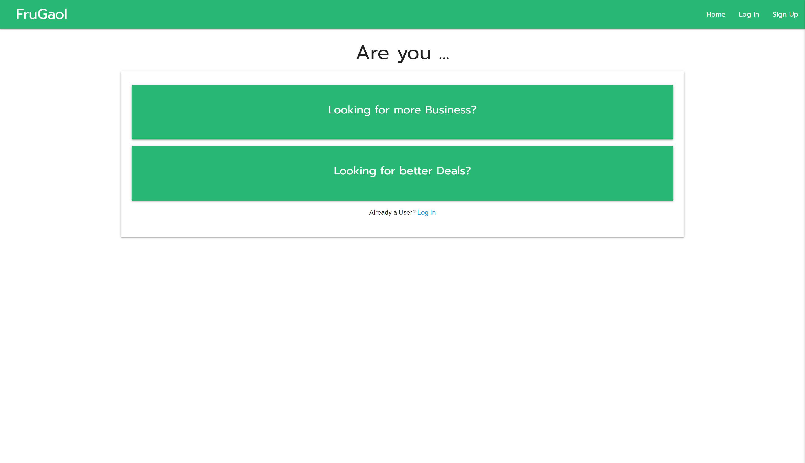 

    - Be able to connect better with customers.
    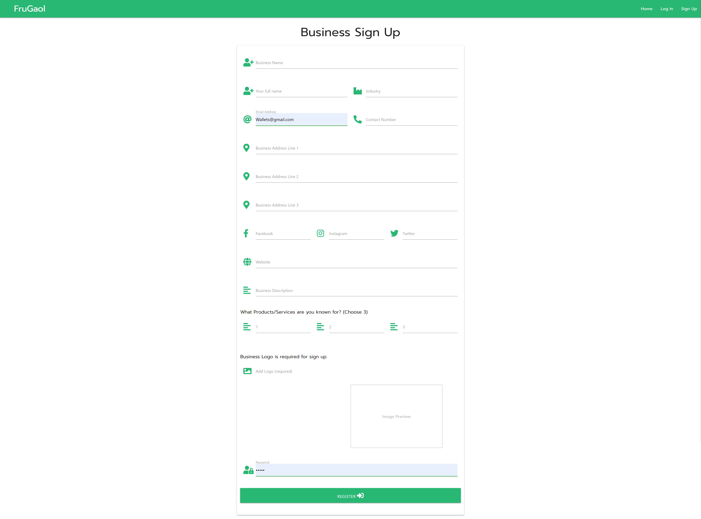

    - Be able to edit my business details however I see fit.
    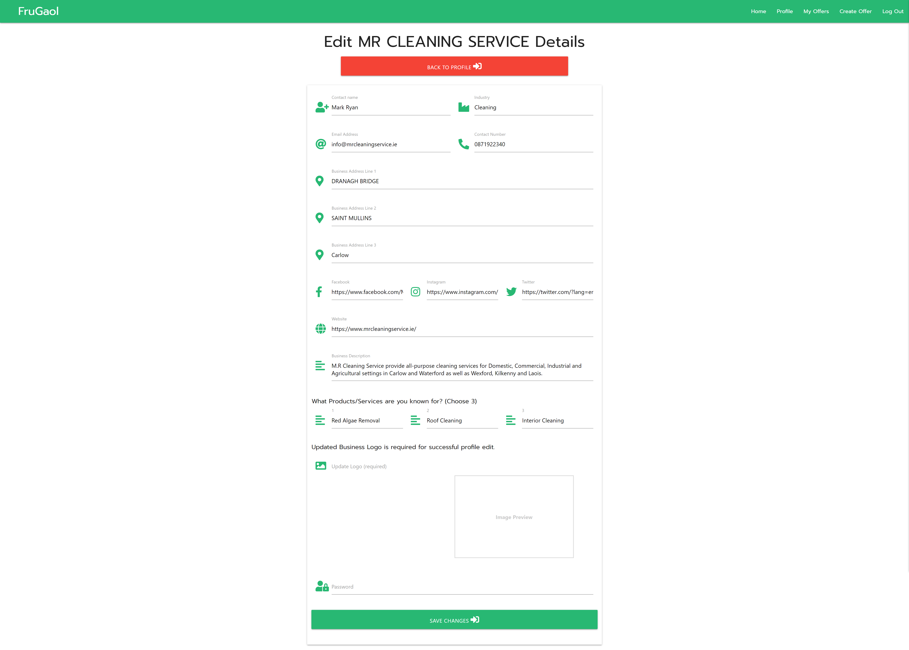
    
    - Be able to communicate special offers/deals and my products & services
    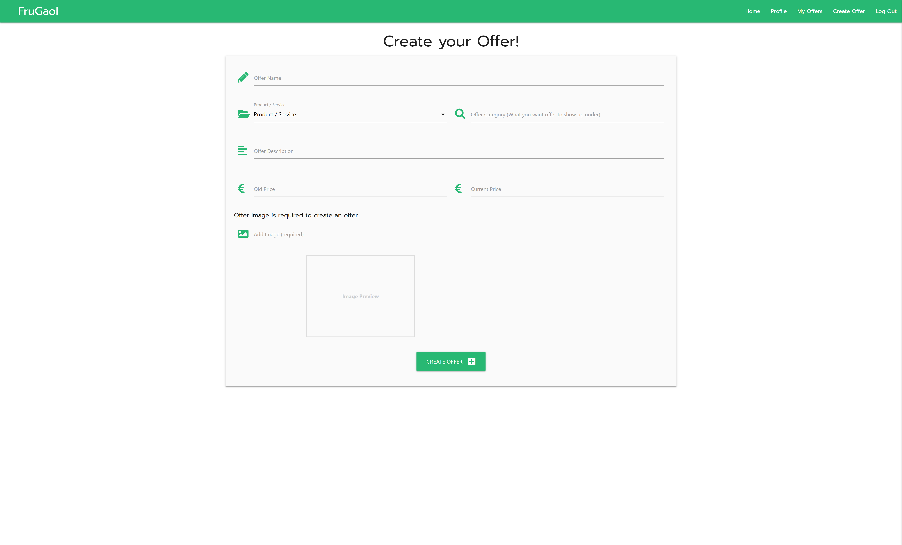

     - Able to edit or delete/finish offers how I see fit
     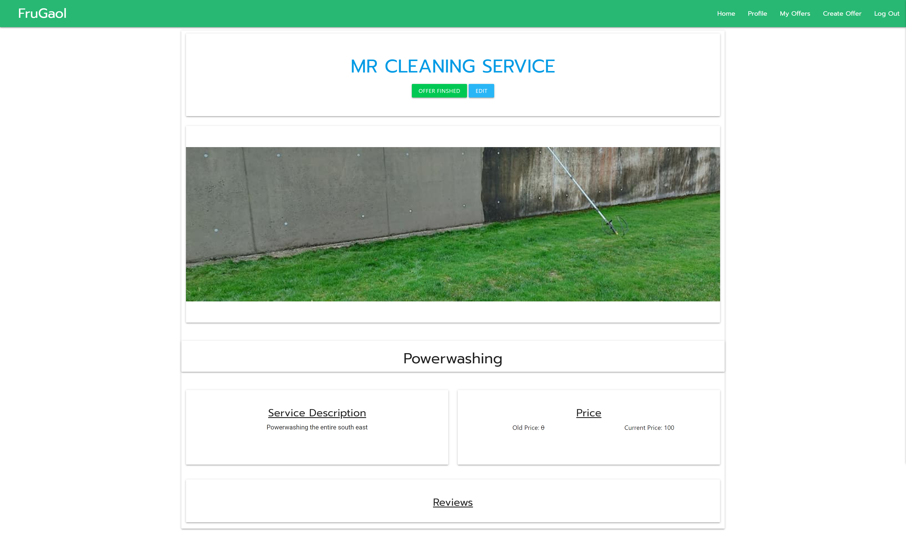

    - Keep track of my offers currently running
    

    - Show more real time offers and deals to entice new customers as well as new products/services on offer 
    

    - Better advertise to customers who are actively looking to buy
    

    - Hear from consumers on what they think of offers through Consumer reviews
    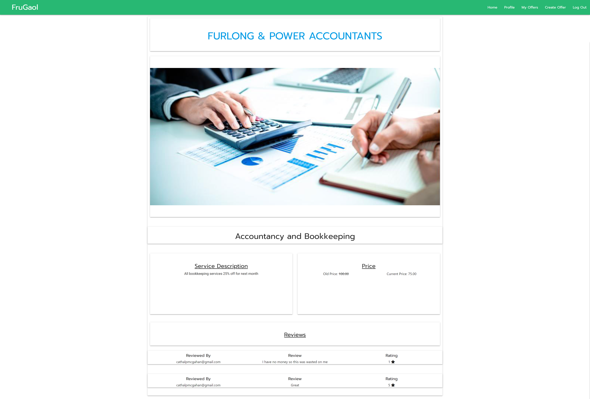

    - Properly show what I do
    

Customer:
- As a customer user I want to:
    - Be informed about local offers/deals and be able to search for specific deals
    

    - I want to be able to communicate quickly, efficiently and effectively to businesses. 
    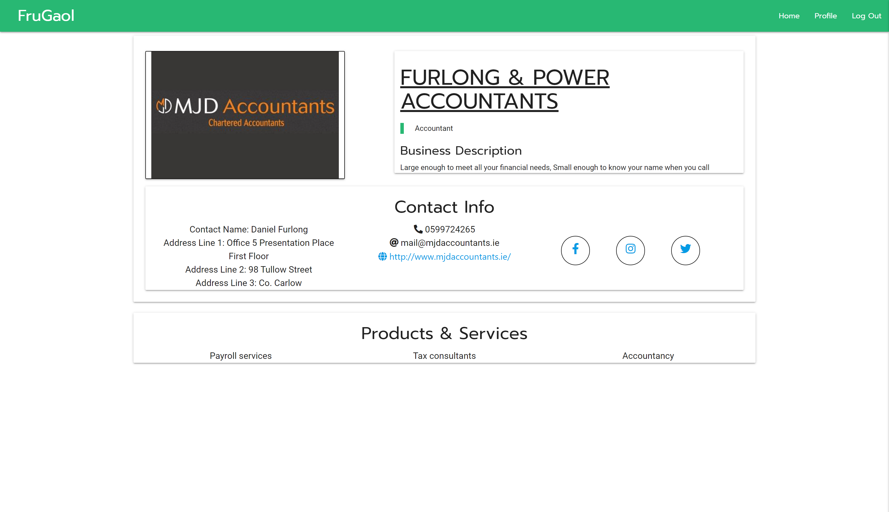

    - I want to be able to leave reviews on products and services and businesses.
    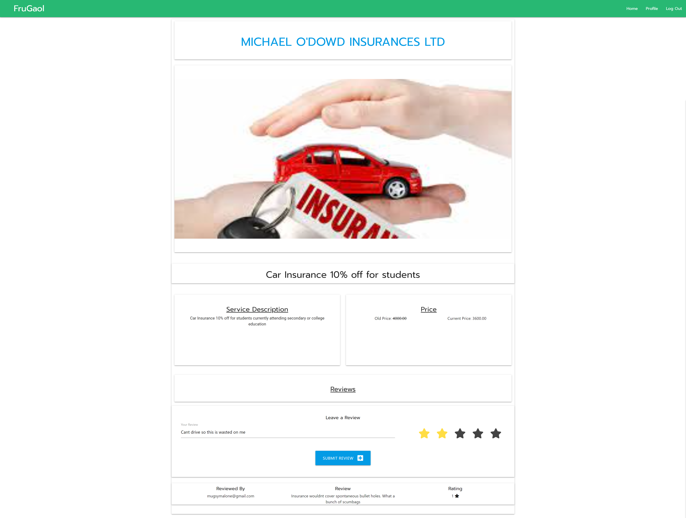

    - I want to find good deals
    

    - I want to edit my contact details profiles
    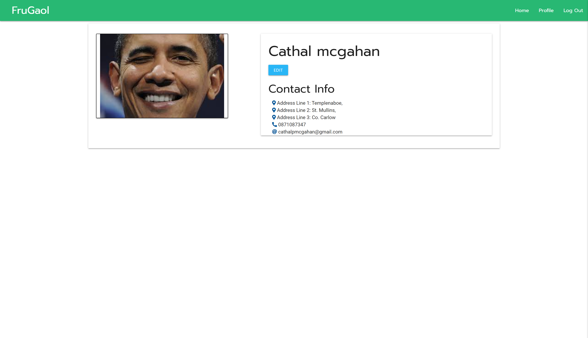

## Manual Testing

## Site Responsiveness

## Bugs Encountered
02/09/2021:  
Project Frugaol was deployed today and sent out to friends and family to test and break. 

This is what has comeback:

#### Profile Image Issue
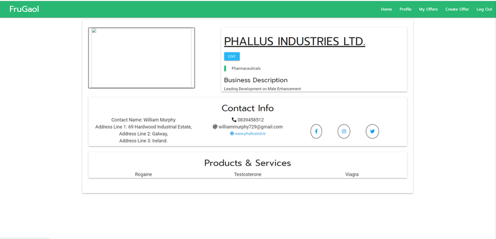

- Logo saved not appearing on business profile.
- After testing further the issue is that image uploaded had spaces in filename which has caused an issue materializng from DB. 
- Fix: Have introduced new if statement that initiates flash message telling user that filenames must not include any gaps. Tested and working.

#### Offer Image Extension not allowed
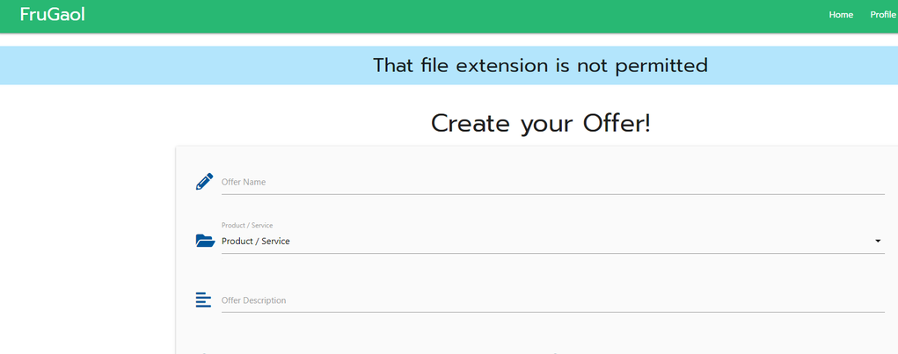

- Offer image extension not permitted. Meaning that attempted upload extension was not a recognised extension from the ALLOWED_IMAGE_EXTENSIONS in app.py. 
- After testing further the issue is that extension was .webp
- Fix: Have added .webp extension to ALLOWED_IMAGE_EXTENSIONS in app.py. 

#### Business Sign Up - No Filename
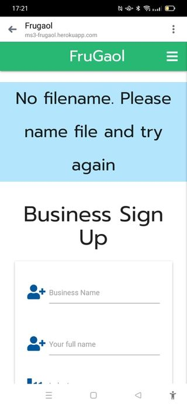

- User attempted to sign up without uploading image. 
- Fix: Have made flash message easier to understand requesting that user must add logo for sign up. 
- Have also introduced h6 heading above image upload to inform user that logo upload is required for sign up

#### Text Align Issue - Business Profile

- Text has not scaled down properly for mobile and circles surrounding social media icons have gone wonky.  
- Fix: Above issues have been fixed through better grid management and centering a div

#### Text Overlap Issue - Offer Profile
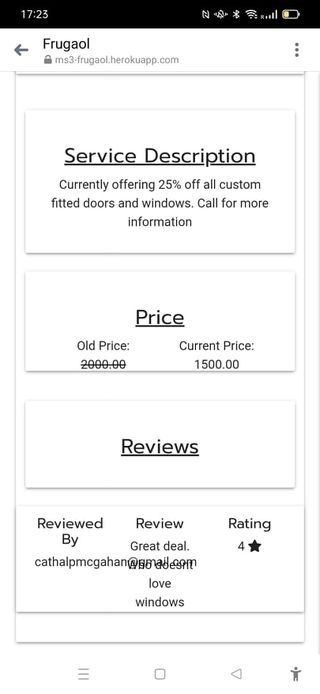

- Text has not scaled down properly for mobile and causing overlap. 
- Fix: Now fixed. Better implemented the grid system for materialize to fix

#### File Upload Nothing Appearing - Business/Consumer/Offer Create
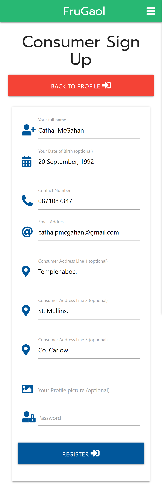

- Nothing showing to user when they upload image
- Fix: Now fixed. Have introduced image preview window so user can see image they have selected

## Outstanding Bugs:
- Unfortunately could not find a way to allow files with gap in name to be uploaded to the app. Have included if statement that if this occurs the user will have to rename file.

- Initial plans was to have both Business users and Consumer users login through the same portal however was unable to crack this. System (and me most likely) were unable to distinguish between the different users. To counteract this I made 2 seperate login portals for each user to login through (see below)
