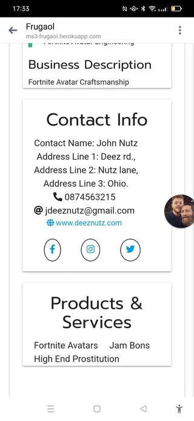

02/09/2021  
Testing was performed on a continuous basis throughout the entirety of this project.

All codes used will be put through the relevant code validators once all user testing and fixes have been complete.

## User Testing:
02/09/2021:  
Project Frugaol was deployed today and sent out to friends and family to test and break. 

This is what has comeback:

#### Profile Image Issue

- Logo saved not appearing on business profile.
- After testing further the issue is that image uploaded had spaces in filename which has caused an issue materializng from DB. 
- Fix: Have introduced new if statement that initiates flash message telling user that filenames must not include any gaps. Tested and working.

#### Offer Image Extension not allowed

- Offer image extension not permitted. Meaning that attempted upload extension was not a recognised extension from the ALLOWED_IMAGE_EXTENSIONS in app.py. 
- After testing further the issue is that extension was .webp
- Fix: Have added .webp extension to ALLOWED_IMAGE_EXTENSIONS in app.py. 

#### Business Sign Up - No Filename

- User attempted to sign up without uploading image. 
- Fix: Have made flash message easier to understand requesting that user must add logo for sign up. 
- Have also introduced h6 heading above image upload to inform user that logo upload is required for sign up

#### Text Align Issue - Business Profile

- Text has not scaled down properly for mobile and circles surrounding social media icons have gone wonky.  
- Fix: Above issues have been fixed through better grid management and centering a div

#### Text Overlap Issue - Offer Profile

- Text has not scaled down properly for mobile and causing overlap. 
- Fix: Now fixed. Better implemented the grid system for materialize to fix